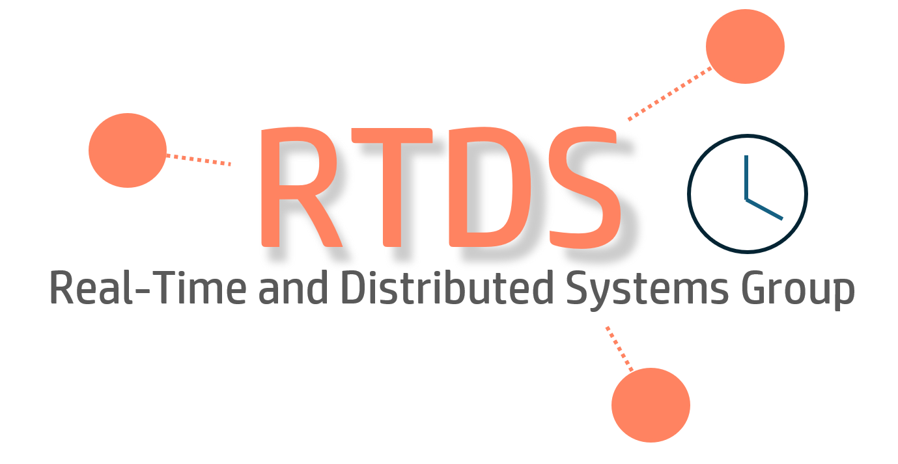
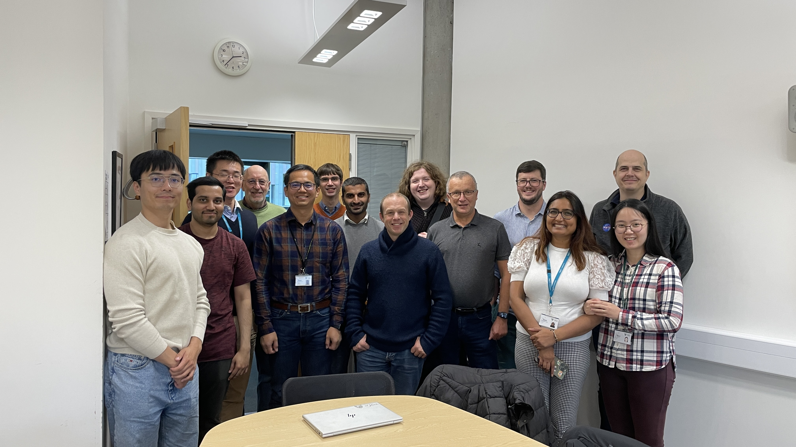

---
# Feel free to add content and custom Front Matter to this file.
# To modify the layout, see https://jekyllrb.com/docs/themes/#overriding-theme-defaults

layout: home
nav_order: 1
---

# Real-Time and Distributed Systems Group (RTDS York)
*Department of Computer Science, University of York, United Kingdom*

## Welcome to RTDS Group at York!

Welcome to the web pages of the Real-Time and Distributed Systems Research Group at York. Established in 1990, our group has been at the forefront of research into all aspects of the design, implementation and analysis of real-time and distributed systems. 

Our research spans embedded systems, IoT, robotics, automotive systems, avionics, and high-performance computing, with strong industry collaborations including Bosch, Rolls Royce, BAE Systems, Airbus, and Huawei.

[Learn more about our research →](/docs/research/)

## Quick Links

<h4>📰 Latest News</h4>

Stay updated with our latest research developments and announcements.

<a href="/docs/news/">View News →</a>

<h4>👥 Our People</h4>

Meet our academic staff, researchers, and PhD students.

<a href="/docs/people/">Meet the Team →</a>

<h4>📚 Publications</h4>

Explore our research publications and academic contributions.

<a href="/docs/publications/">View Publications →</a>

<h4>🎯 Research Impact</h4>

Discover how our research has transformed industries worldwide.

<a href="/docs/research/impact/">View Impact →</a>

<h4>📞 Contact</h4>

Get in touch for collaboration opportunities and inquiries.

<a href="/docs/contact/">Contact Us →</a>

## Academic Staff

The group is structured around the interests of the permanent academic staff:

- [Prof. Iain Bate](https://www.cs.york.ac.uk/people/?group=Academic%20and%20Teaching%20Staff&username=ijb) (Group Lead)
- [Prof. Alan Burns](https://www.cs.york.ac.uk/people/?group=Academic%20and%20Teaching%20Staff&username=burns) (Emeritus)
- [Prof. Andy Wellings](https://scholar.google.co.uk/citations?user=yPa4QrkAAAAJ&hl=en) (Emeritus)
- [Dr. Robert Davis](https://www-users.york.ac.uk/~rd17/)
- [Dr. Ian Gray](https://www.cs.york.ac.uk/people/?group=Academic%20and%20Teaching%20Staff&username=iang)
- [Dr. Xiaotian (Steven) Dai](https://www.xiaotiandai.com)
- [Dr. Steven Wright](https://www.cs.york.ac.uk/people/?group=Academic%20and%20Teaching%20Staff&username=saw)
- [Dr. Poonam Yodav](https://www.cs.york.ac.uk/people/?group=Academic%20and%20Teaching%20Staff&username=yadav)
- [Dr. Pengcheng Liu](https://www.cs.york.ac.uk/people/?group=Academic%20and%20Teaching%20Staff&username=liup)
- [Dr. Chris Crispin-Bailey](https://www.cs.york.ac.uk/people/?group=Academic%20and%20Teaching%20Staff&username=chrisb)
- [Dr. John Oyekan](https://www.cs.york.ac.uk/people/joyekan)

